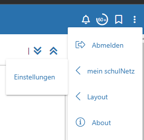
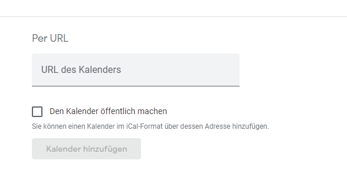
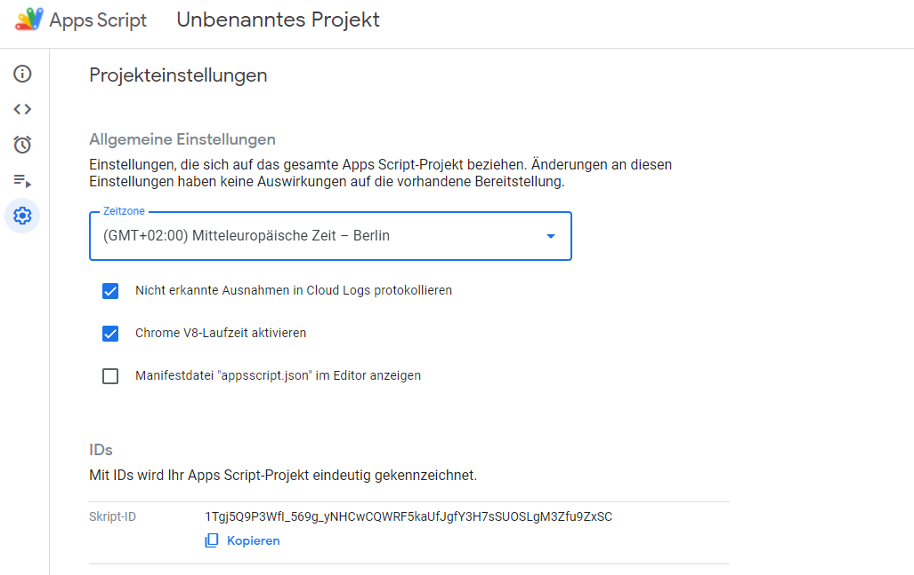
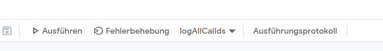
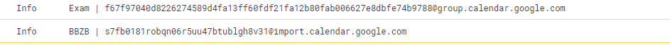
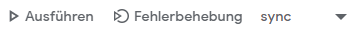

# Exam date Calendar Sync Tool

## Purpose
This tool was Developed to Copy events modify them and then insert them into another Calendar.
The Source-Events are provided by Schulnetz, every student can Import those URLs into their Calendar.
The Events are Filtered, only the Exams & Projects will endup in the Target calendar.
I personally only want the Exam entries in my Calendar and am bothered by the repetitive entries from the normal lessons.

## Disclaimer
I don't guarantee that this will work. You need a Google Account to run this project in.
I don't guarantee anything.
You will need some computer know-how.

## Setup

### Sync Calender Events from Schulnetz to you Google Calendar:
Go to Schulnetz settings

There you can send a link to you Calendar to you Email.

Go to your Google-Calendar and add the Calndar (Add calendar -> URL)


Create an Additional Calendar, you will need this one Later.

### Setup Google Apps Script
Go to [https://script.google.com/](https://script.google.com/) and click on "New Project"
Go to Settings:

Here you will find the Script id for your Project, you will need that later.
Go to [https://script.google.com/home/usersettings](https://script.google.com/home/usersettings) and enable GAS API


### Local setup
Install NPM and clone the git repo. If you cant figure out how to do this with the help of google, its time to abort now.
open the project and run `npm i`
and `npm install -g @google/clasp`
then run `clasp login` and login with your Google account

copy the `.env.example` file and rename it to `.env`

in the [.clasp.json](.clasp.json) file replace the id with you project id.

Run `npm run deploy` and type y if it asks you if you are sure you want to push.

In Google Apps script refresh the page with ctrl + f5 and execute the function `logAllCallIds` (select it on the dropdown)

In the Log you will find 2 Important Entries:

Everything before the `|` is the name, everything after is the ID. You will need the ID for your source and target Calendar later.

### Config
Open the `.env` file and fill in the Values, here are some explanations:
(write all values without quotes)
SOURCE_CAL_ID: the Calendar id from the calendar you importet over the URL (ends with @import.calendar.google.com)
TARGET_CAL_ID: the Calendar id of the Calendar you want the events to end up in
DO_CAL_LOG: whether or not to show the calendar names and ids in log. i recomend "false"
MONTHS_IN_ADVANCE: Moths in advance to sync events for (optional)
NUMBER_OF_EVENTS_BEFORE_SKIP: the Amount of "Same-Name" entries allowed (optional)
REQUIRE_CLASSNAME_IN_EVENT: if "true" removes all holidays etc. recomend "false"
REMOVE_CLASSNAME_FROM_EVENT: Removes the Classname from the Eventname
CLASS_NAME: Your classname, this is a part of the Calendar Title in the Source calendar. example: "BMLT20" (required if `REQUIRE_CLASSNAME_IN_EVENT` or `REMOVE_CLASSNAME_FROM_EVENT` is true )

### Run
Execute `npm run deploy` and Refresh you google apps script page.
Run the `sync` function in google apps script

This will take around 30 seconds depending on your config.
The console should display something like
```
Syncing Calenders from BBZB to Exam
```
Your Calendar will now Sync up every 12 hours.
